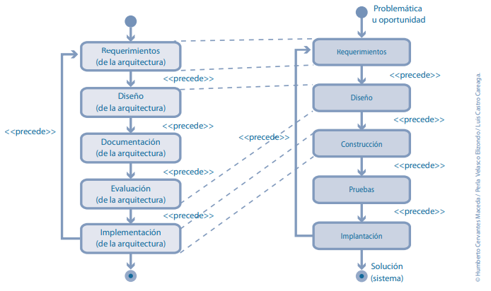

# Arquitectura de Software

No sería adecuado iniciar un proyecto sin un plan sólido; lo mismo ocurre con el diseño de arquitectura de software. Al hacer que este proceso sea más eficaz, puedes justificar todos tus requisitos de manera adecuada y brindar a las partes interesadas la oportunidad de presentar sus aportaciones.

Mediante el uso de las imágenes técnicas y un cuidadoso proceso de planeación, puedes hacer un esbozo de la arquitectura y el diseño de tu software antes de empezar a
crear un prototipo.

La arquitectura de software, en un sentido estricto, se define como el conjunto de estructuras que componen el sistema, lo que incluye elementos de software, las relaciones entre los mismos, y las propiedades tanto de los elementos como de sus relaciones (SWEBOK, 2014). En otras palabras, la arquitectura de software define el conjunto de componentes de un sistema, las interfaces de comunicación de los mismos, y la manera como estos componentes se comunican entre ellos usando estas interfaces.

```bash
La arquitectura de software de un sistema es el conjunto de estructuras necesarias para razonar sobre
el sistema. Comprende elementos de software, relaciones entre ellos, y propiedades de ambos.
(Bass, Clements y Kazman, 2012).
```

## ¿Para que sirve la arquitectura de software?

El diseño de una arquitectura de software utiliza los conocimientos de programación para planear el diseño general del software de modo que puedan agregarse detalles más adelante, lo cual permite a los equipos de software delimitar el panorama general y comenzar a elaborar un prototipo.

## ¿Cómo diseñar una arquitectura de software?

- Comprende claramente cuáles son tus requisitos

- Comienza a pensar en cada componente

- Divide tu arquitectura en “rebanadas”

- Hacer un prototipo

- Identifica y cuantifica los requisitos no funcionales

## Ciclo de desarrollo de la arquitectura

Actividades asociadas al ciclo de desarrollo de la arquitectura (a la izquierda) y su mapeo dentro de las actividades técnicas del desarrollo de sistemas (a la derecha).

[](imgs/cicloArquitectura.png)

## Beneficios de la arquitectura

### Aumentar la calidad de los sistemas

La relación entre arquitectura y calidad es directa: la arquitectura permite satisfacer los atributos de calidad de un sistema y estos son, a su vez, una de las dos dimensiones principales asociadas con la calidad de los sistemas, siendo la segunda el número de defectos. Hacer una inversión significativa en el diseño arquitectónico contribuye a reducir la cantidad de defectos, la cual, de otra forma, podría traducirse en fallas que impactan negativamente en la calidad.

### Mejorar tiempos de entrega de proyectos

La arquitectura de software juega un rol importante para que los sistemas sean desarrollados en tiempo y forma. En principio, algunos de los elementos que se identifican dentro de las estructuras arquitectónicas ayudan directamente a llevar a cabo estimaciones más precisas del tiempo requerido para el desarrollo.

Por otro lado, una estructuración adecuada ayuda a asignar el trabajo y facilita el desarrollo en paralelo del sistema por parte de un equipo. Lo anterior optimiza el esfuerzo realizado y reduce el tiempo que toma el desarrollo del sistema. 

El diseño de la arquitectura involucra con frecuencia la reutilización, ya sea de soluciones conceptuales o de componentes existentes, y esto ayuda también a reducir de manera significativa el tiempo de desarrollo. Por último, y relacionado con la calidad de manera directa, la reducción de defectos resultante de un buen diseño da como resultado una necesidad menor de volver a realizar el trabajo, lo cual contribuye a que los sistemas se entreguen en los plazos previstos.

### Reducir costos de desarrollo

Respecto del costo de un sistema, la arquitectura también es fundamental. La reutilización es un factor importante en el momento de hacer un diseño arquitectónico porque ayuda a reducir costos. Por otra parte, es posible considerar la reutilización como un atributo de calidad del sistema y tomar decisiones de diseño al respecto con la finalidad de lograr una disminución de costos en el desarrollo de sistemas subsecuentes. Reiteramos asimismo que un buen diseño contribuye a aminorar la necesidad de volver a hacer el trabajo y facilita el mantenimiento, lo cual también conduce a bajar los gastos.

# Patrones de Diseño

Los patrones de diseño son soluciones habituales a problemas que ocurren con frecuencia en el diseño de software. Son como planos prefabricados que se pueden personalizar para resolver un problema de diseño recurrente en tu código.

No se puede elegir un patrón y copiarlo en el programa como si se tratara de funciones o bibliotecas ya preparadas. El patrón no es una porción específica de código, sino un concepto general para resolver un problema particular. Puedes seguir los detalles del patrón e implementar una solución que encaje con las realidades de tu propio programa.

## Clasificación de los Patrones de Diseño

Los patrones de diseño varían en su complejidad, nivel de detalle y escala de aplicabilidad al sistema completo que se diseña. Me gusta la analogía de la construcción de carreteras: puedes hacer más segura una intersección instalando semáforos o construyendo un intercambiador completo de varios niveles con pasajes subterráneos para peatones.

- **Patrones creacionales:** Proporcionan mecanismos de creación de objetos que incrementan la flexibilidad y la reutilización de código existente.

- **Patrones estructurales:** Explican cómo ensamblar objetos y clases en estructuras más grandes a la vez que se mantiene la flexibilidad y eficiencia de la estructura.

- **Patrones de comportamiento:** Se encargan de una comunicación efectiva y la asignación de responsabilidades entre objetos.

## Patrones Creacionales

### Singleton

Singleton es un patrón de diseño creacional que nos permite asegurarnos de que una clase tenga una única instancia, a la vez que proporciona un punto de acceso global a dicha instancia.

### Factory

El método Factory también es uno de los patrones de diseño más populares. El problema que pretende resolver el método Factory es crear objetos sin utilizar el constructor convencional. En su lugar, toma la configuración (o descripción) del objeto que deseas y devuelve el objeto recién creado.

### Abstract Factory

El método Abstract Factory sube el nivel del método Factory al hacer que haya «factories» abstractas y, por tanto, sustituibles sin que el entorno de llamada conozca la factory exacta utilizada o su funcionamiento interno. El entorno de llamada sólo sabe que todas las «factories» tienen un conjunto de métodos comunes a los que puede llamar para realizar la acción de instanciación.

### Builder 

El patrón Builder es uno de los patrones de diseño creacionales de JavaScript más complejos y flexibles. Te permite construir una a una las características de tu producto, proporcionándote un control total sobre cómo se construye tu objeto, al tiempo que abstrae los detalles internos.

### Prototype

El patrón de diseño Prototype es una forma rápida y sencilla de crear nuevos objetos a partir de objetos existentes, clonándolos.

Primero se crea un objeto prototipo, que puede clonarse varias veces para crear nuevos objetos. Resulta útil cuando instanciar directamente un objeto es una operación que consume más recursos que crear una copia de uno existente.

# 

## Ventajas de los Patrones de Diseño

✅ Reutilización de soluciones probadas

✅ Mantenibilidad

✅ Comunicación mejorada

✅ Escalabilidad

✅ Facilita la arquitectura: Los patrones de diseño ayudan a establecer una arquitectura sólida desde el principio, lo que es fundamental para proyectos a gran escala.

## Desventajas de los Patrones de Diseño

❌ **Complejidad inicial:** Aplicar patrones de diseño puede aumentar la complejidad del código, especialmente en situaciones donde un patrón no es necesario, lo que puede llevar a un código innecesariamente complicado.

❌ **Rigidez:** En situaciones en las que los requisitos cambian con frecuencia, la aplicación rígida de patrones de diseño puede hacer que el software sea menos adaptable a los cambios.

❌ **No siempre aplicables:** No todos los problemas se pueden resolver de manera eficiente mediante patrones de diseño. Algunos problemas pueden requerir soluciones específicas y personalizadas.

❌ **Pérdida de creatividad:** Al seguir patrones de diseño de manera estricta, los desarrolladores pueden sentirse limitados en su capacidad para crear soluciones originales y creativas.